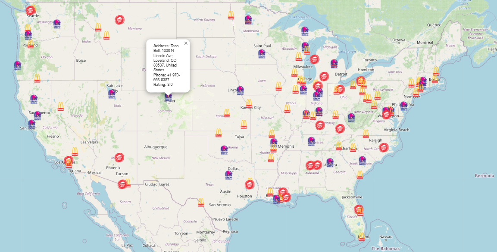

# U.S. Restaurant Geodata Visualization with Folium

This project visualizes the geospatial data of U.S. restaurants using **Folium**, a powerful Python library for interactive maps. By leveraging restaurant location data, this tool helps you to better understand and explore restaurant distributions across the United States.

## Features

- **Interactive Map**: Displays the geographical location of various restaurants across the U.S.
- **Custom Markers**: Uses icons and popups to represent different restaurant chains like McDonald's, Taco Bell, and Pizza Hut.
- **Dynamic Visualization**: Provides an engaging, zoomable map to explore restaurant locations interactively.

## Technologies Used

- **Python**: The primary programming language for data processing and visualization.
- **Folium**: A Python wrapper for Leaflet.js, used to create interactive maps.
- **Pandas**: For handling and manipulating the restaurant data in a structured format.



## Dataset & Installation

1. Download Datast:

   ```bash
   Kaggle: https://www.kaggle.com/datasets/kwxdata/380k-restaurants-mostly-usa-based

2. Clone the repository:

   ```bash
   git clone https://github.com/DamienNaz/repositoryname.git
